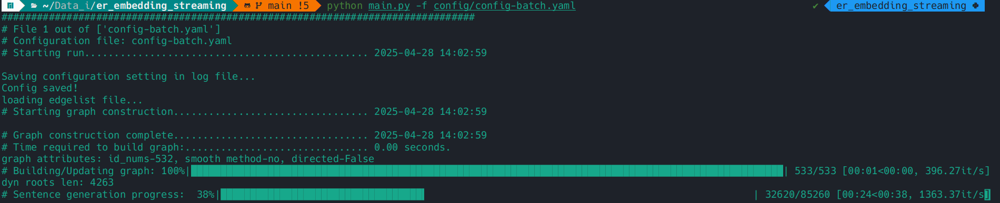
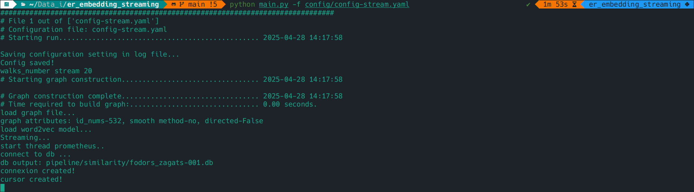
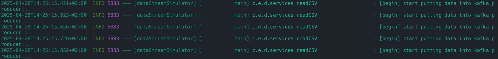
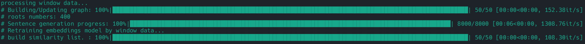
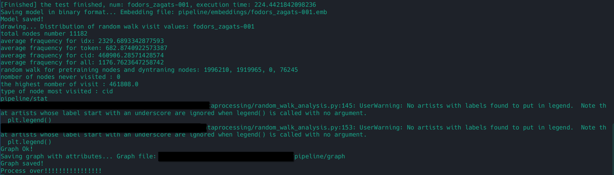
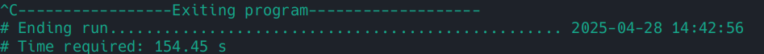
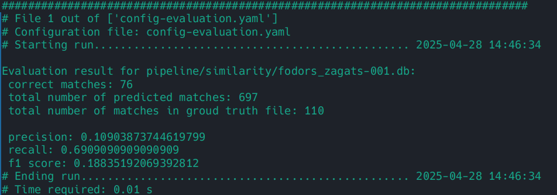

# Guide for ER project
## Preparation
To run the whole incremental process, we need two terminal. 
- <b>Terminal 1 (T1)</b> for the kafka consumer and train the embedding model. folder: `er_embedding_streaming/`
- <b>Terminal 2 (T2)</b> for the kafka producer who simulate the data sequences. folder: `dataStreamSimulator/`

The example datasets to test is in the folder: `er_embedding_streaming/Data_example`

### Prep for T1-Consumer 
#### T1-1. Clone the code
```bash
git clone https://github.com/Mzhongwei/er_embedding_streaming.git
```
you will get code with the following structure:
```
|----config/
|    |------default/     # Default configuration settings
|    |------examples/    # Example configuration files
|----dataprocessing/     # All data processing methods, receive data by kafka consumer
|----dynamic_embedding/  # Core methods for dynamic embedding
|----Data_example/       # Example datasets for testing
|----utils/              # Utility functions and helper scripts
|----main.py
|----requirements.txt
|----README.md
```

#### T1-2. Create a virtual environment, activate and install dependencies:
In the folder `er_embedding_streaming`, execute commands:

```bash
python3 -m venv venv
source venv/bin/activate # if you get an error, try `. venv/bin/activate`

pip install -r requirements.txt
pip install git+https://github.com/dpkp/kafka-python.git
```

### Prep for T2-Producer
#### T2-1. Clone the code
```bash
git clone https://github.com/Mzhongwei/dataStreamSimulator.git
```
#### T2-2. Set configuration file
In folder `dataStreamSimulator`, you can find configuration file: `src/main/resources/application.properties.example`

Remove extension `.example`


## Execution

### 1. Pre-training process:

#### 1.1. Set configuration variables (T1)
- For testing, do not need to change anything
- During experiments, set your own variables. You can find some examples in `config/examples/`

> more config settings and corresponding explication can be found in files under the directory `config/default/`, but do not modify parameters in these files directly.

#### 1.2. Execute the pre-training script (T1)

```bash
python main.py -f config/examples/config-batch.yaml
```
In termial, you'll get:

This may take a few seconds or minutes. 
##### 1.3. Verify the output in the following folders (T1)
```
pipeline/graph/<output_file_name>.graphml   # xml
pipeline/embeddings/<output_file_name>.emb  # binary file
```
`output_file_name` is set in configuration file, by default, `output_file_name: fodors_zagats`

### 2. Incremental entity resolution

#### 2.1. Set configuration (T1)

- Nothing to do when testing
- During experiments, keep in mind the following variables.
```
graph_file: pipeline/graph/<output_file_name>.graphml
embeddings_file: pipeline/embeddings/<output_file_name>.emb
kafka:
    topicid: <user_name>
    groupid: <user_name>_consumer_group
```
> ⚠️ Attention 1:  `kafka_topic_id` needs to be the same as topic ID of producer, here the producer is created by `Simulator`.

> ⚠️ Attention 2: Each user should set `topicid` by his or her own `user_name` to prevent mixing data from different producer-consumer applications when multiple applications were running at the same time

#### 2.2. Execute the kafka consumer (T1)

```bash
python main.py -f config/examples/config-stream.yaml
```
You'll get..

Kafka consumer service is waiting for the producer to send messages to broker.

#### 2.3. Run the simulator (T2)
<b>In another terminal 2</b> (IMPORTANT!!!)

##### 2.3.1. Modify the config file by your own settings
Find confi file in `dataStreamSimulator/src/main/resources/application.properties.example`

Uncomment the line `# csv.file.path=<your file path>`

Replace `<your file path>` by the file path to the dataset which will be sent as streams
- For initial test, replace the `csv.file.name` with the path where you cloned er_embedding_streaming in section ER  step 1:
`csv.file.path=<rootFolder>/er_embedding_streaming/Data_example/fodors_zagats-tableB.csv`
- During experiments, pay attention to the following variables:
```
spring.kafka.producer.topic-id=<user name>
spring.kafka.producer.group-id=<user name>_producer_group
csv.file.name=<location of dataset>
```
> Make sure kafka producer ID is your own ID, which is also the same as what you set for the consumer.

> Remember to modify the file path to dataset as well

##### 2.3.2. Run the simulator
Start Kafka producer service

In the project directory, execute the following command to run the simulator:
```bash
mvn spring-boot:run
```
The simulator is running correctly if you see the following messages:


#### 2.4. Verify of programme execution (T1)
Messages are received when you see the following prompts:


The embedding model is being retrained if you see..



#### 2.5. Stop the program (T1)

All data is processed when you see `process over!!!!` Like this:


In terminal, stop the program with ```ctrl + c```



#### 2.6. Verify the output (T1)
You can find similarity file in
```
pipeline/similarity/<output_file_name>.db
```
### 3. Evaluate
#### 3.1. Set config (T1)

- nothing to do when testing
- remember to modify the following variables during experiments. `Similarity_file` is the output result in step 4.5, `match_file` is the ground truth for these dataset
```
similarity_file:pipeline/similarity/<output_file_name>.db
match_file:<ground truth file>
```
#### 3.2. Run the evaluation process (T1)
Execute the following command:
```bash
python main.py -f config/examples/config-evaluation.yaml
```
Results of evaluation are shown as follows: 

 

Get statistical results shown as graphs by command:
```bash
scp <original path> <new path>
```
<br><br>
> Repete steps 1-3 in "Execution" section for more tests
